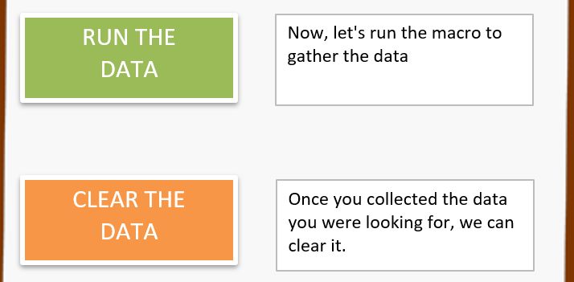
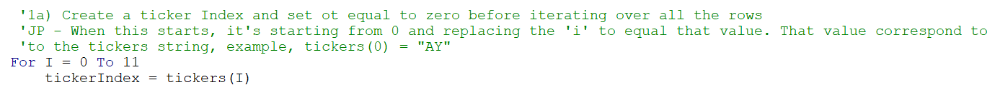
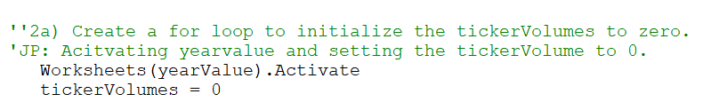
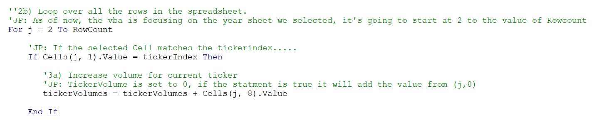
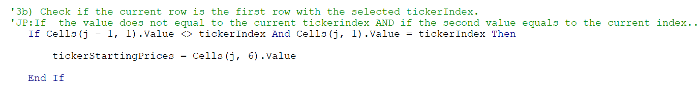
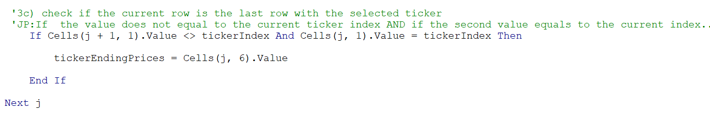
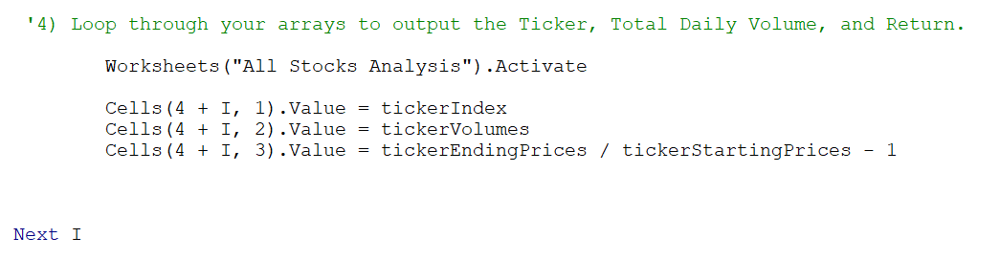
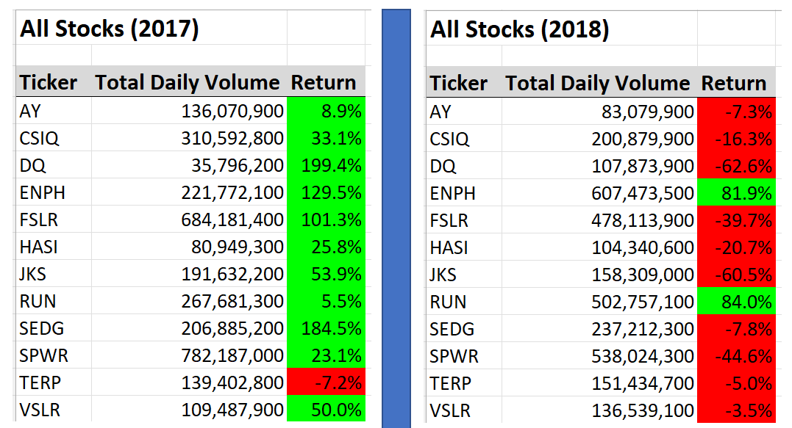

# Rutgers - Module 2 Challenge
This is a Module 2 challenge, focusing on VBA on stocks from 2017 to 2018.
## Overview of Project
&nbsp;&nbsp;&nbsp;&nbsp; Purpose of this project is to understand VBA programming. To understand the basic structure of creating arrays, creating loops, and reading/storing the values for each specific task.  It’s a different language, but this can help in the future. Imagine someone who doesn’t know nothing about excel needs a specific report. Instead of having one person writing a formula over and over again, you can be the hero and say, “Hey I can create a macro where it can automatically run the formula with a click of a button.” That my friend, is what we did. 

&nbsp;&nbsp;&nbsp;&nbsp; By viewing the data within the year of 2017, you can see our return percentage has amazing results. If you look within the materials, Ticker SPWR has the highest daily volume with a return percent of 23.1. Ticker DQ has the lowest daily volume with a Return percent of 199.4%. This idea can tell story, however, not a good one as other Tickers has similar daily volume, but the percent does not come close.

&nbsp;&nbsp;&nbsp;&nbsp; By viewing the data within the year of 2018, you can see our average return percentage is negative 8.5. Tickers ENPH and RUN are the only tickers with positive return percentage. Ticker AY has the lowest daily volume with a return percent of negative 7.3. 

## Results
&nbsp;&nbsp;&nbsp;&nbsp; I was a able to create two Macros with commend buttons. Both Macros act different based on what you are clicking on. We will be fousing on the challenge of the project only. I also copied the Macro formula onto my github if anyone wants to review it.

  

&nbsp;&nbsp;&nbsp;&nbsp; The first thing I had to do was to create a loop by assigning _i_ = 0 to 11. After that, it's going to replace the value of _i_ to the starting point of 0 and end at 11. Then, I assigned tickerIndex to equal to the value of tickers(_i_).   

         

&nbsp;&nbsp;&nbsp;&nbsp; Now we will be focusing on the year we slected within the Macro. If you selected 2018, it will activate that sheet. Then I assigned the tickerVolume to equal to zero. Our loop will begin shortly. 

  

&nbsp;&nbsp;&nbsp;&nbsp; Now I assigned _j_ to equal to 2 to Rowcount (_Rowcount equals to the row starting and ending within column "A"_). If the frist statment is true, it will follow the operation.

  

&nbsp;&nbsp;&nbsp;&nbsp; The next IF statement. We are focusing on the ticker starting price but we want to make sure we are getting the correct value. The script listed below will do that. It's focuing on the current row (_"A2"_) and before that row (_"A1"_), makeing sure we are obtaining the starting price.

  

&nbsp;&nbsp;&nbsp;&nbsp; The next IF statement. We are focusing on the ticker ending price but we want to make sure we are getting the correct value. The script listed below will do that. It's focuing on the current row (_"A2"_) and After that row (_"A1"_), makeing sure we are obtaining the ending price.

  

&nbsp;&nbsp;&nbsp;&nbsp; After all that, the value will be pasted onto the following the cells. Repeating the loop, but to the next value.   

 

Once the macro is complete, we will get the following format listed below. 

## Summary

